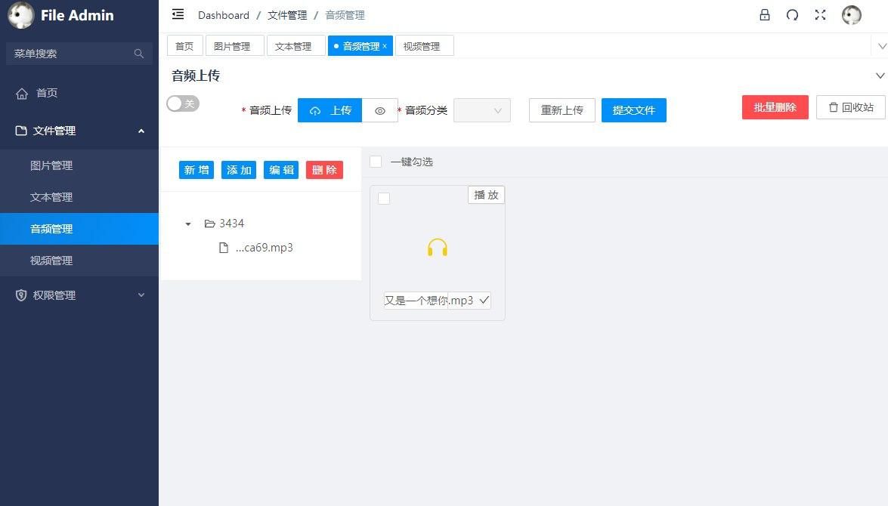

# FileManageApi
>项目背景：用于个人文件管理，收藏

项目基于flask

# 后台管理界面


# 前端
[FileManage](https://github.com/renserve/fileManage)

**注意：项目启动前先将app/source.zip（config，assets）解压至项目app/目录下；
项目启动时将package/lin.zip解压后替换依赖包lin
 [解决表单验证问题](https://github.com/TaleLin/lin-cms-flask/issues/125)**

将根目录下的cms.sql导入数据库，登录账号super，密码：123456
## Run
``` bash

# 安装依赖
pip install

# 查看package.json script运行命令
npm run dev

# 全局安装apidoc
npm install apidoc -g

# 生成api文档（文档未完善）
npm run docs
```
### 参考项目
[lin-cms-flask](https://github.com/TaleLin/lin-cms-flask)
